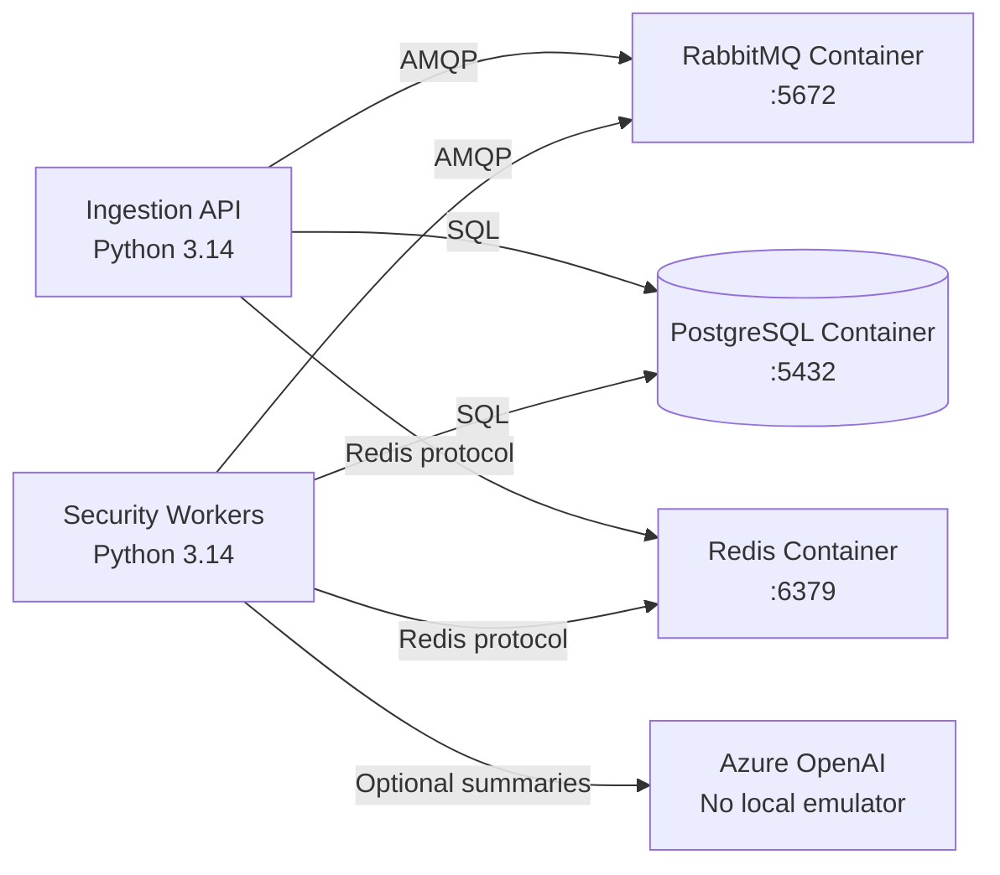

# Azure Debug Plan

> This plan is the source of truth for generating the
> VS Code debug setup in this workspace.
>
> **Status:** Implemented
> **Execution Mode:** Auto
> **Created:** 2026-09-26T00:27:22.4848704-04:00
> **Last Updated:** 2026-09-26T00:35:49.3545838-04:00
>
> <!-- Guided Mode (default) - hand-holds the user through review and approval before generating. -->
> <!-- Auto Mode (aka YOLO mode) — skips approval gates and runs generation unattended. -->

---

## Prerequisites

| Tool / Extension | Category | Service(s) | Installed | Version |
|------------------|----------|------------|-----------|---------|
| Python | Runtime | * | ✅ | 3.14.3 |
| pip | Package manager | * | ✅ | 25.3 |
| Docker | Container runtime | ingestion-api, security-workers | ✅ | 29.1.3 |
| Docker Compose | Compose provider | ingestion-api, security-workers | ✅ | v2.40.3-desktop.1 |
| VS Code Docker extension | VS Code extension | ingestion-api, security-workers | ❓ | Not confirmed |

> ⚠️ **Action required:** Confirm the VS Code Docker extension marked ❓ is installed. Docker Desktop and Compose are confirmed ready; the standalone `pip` command is not on PATH, but `python -m pip` is available.

---

## Debug Configurations

Each checked service produces a VS Code debug configuration in `.vscode/launch.json`.

| Generate | Debug Config Name | Service Label | Service Root | Project Type | Runtime | Version | Azure Dependencies |
|----------|--------------------|---------------|--------------|--------------|---------|---------|---------------------|
| [x] | Ingestion API (debug) | Ingestion API | ./services/ingestion-api | container-app | python | 3.14.3 | PostgreSQL Flexible Server, RabbitMQ, Azure Cache for Redis |
| [x] | Security Workers (debug) | Security Workers | ./services/security-workers | container-app | python | 3.14.3 | PostgreSQL Flexible Server, RabbitMQ, Azure Cache for Redis, Azure OpenAI (optional) |
| [x] | Debug All Services | Debug All Services | — | *Compound Config* | — | — | — |

ℹ️ Project Type Descriptions

| Project Type | Description |
|-------------|-------------|
| container-app | Python service packaged with a Dockerfile and run locally with its container dependencies. |

---

## Orchestrator

| Orchestrator | Container Runtime | Compose Command | Description |
|-------------|-------------------|-----------------|-------------|
| Docker Compose | Docker | `docker compose` | Uses the existing Compose project and confirmed Docker Desktop engine to run local dependencies. |

---

## Emulators

| Dependent Service | Emulator | Purpose |
|-------------------|----------|---------|
| PostgreSQL Flexible Server | PostgreSQL Container | Local relational storage for normalized events, incidents, detections, risk scores, and lifecycle state. |
| RabbitMQ | RabbitMQ Container | Local durable event transport, retries, and dead-letter routing. |
| Azure Cache for Redis | Redis Container | Local Celery result backend and short-lived coordination state. |

Azure OpenAI is optional and has no local emulator; investigation summaries remain disabled unless its endpoint and key are configured.

---

## Architecture Diagram

The ingestion API and worker connect to shared local PostgreSQL, RabbitMQ, and Redis containers; the worker can optionally call Azure OpenAI for investigation summaries.

---

## Migrations

| Generate | Service | Migration Tool |
|----------|---------|----------------|
| [x] | Ingestion API + Security Workers (shared schema) | Alembic |

Migration files are under `migrations/`; no existing migration command is registered in a project script runner.

---

## API Test Collections

| Generate | Service | Description |
|----------|---------|-------------|
| [x] | Ingestion API | 

HTTP Endpoints (7)
 GET /api/health GET /api/readiness POST /api/v1/events POST /api/v1/events/batch GET /api/v1/incidents/{incident_id} GET /api/docs GET /api/openapi.json 
 |

---

## Convenience Scripts

| Generate | Script | Registered In | Description |
|----------|--------|---------------|-------------|
| [ ] | None detected | — | No existing convenience scripts or script runner were found. |

## Debug Configuration Checklist

Debug Configuration Checklist:
✅ Ingestion API (debug) — Uvicorn emitted `Application startup complete`; `/api/health` returned 200 and `/api/openapi.json` returned 200.
✅ Security Workers (debug) — Celery connected to RabbitMQ and Redis and emitted `ready.` using the Windows thread pool.
✅ Debug All Services — compound sequence started the API once and the worker once; API returned 200 for `/api/health`, and the worker emitted `ready.`.